# Tienda de productos 3D personalizables (My3DStore)

## Propósito de la aplicación web
Que puedas encontrar o personalizar un producto acorde a tus necesidades.  
Pudiendo elegir dimensiones, colores, logos, y materiales, para el producto que busques, para finalmente imprimirlo con una impresora 3D.

El nombre de la aplicación web será **“My3DStore”**.  

My3DStore está enfocado a personas particulares, para uso personal.

---

## Requisitos funcionales
- Gestión de usuarios (Inicio de sesión, registro, cuenta…).
- Catálogo de productos.
- Personalización 3D.
- Incorporación de inteligencia artificial.
- Proceso de compra (método de pago, confirmación de pedido, envío de notificaciones de compra y seguimiento).
- Atención al cliente.

---

## Requisitos no funcionales
- La interfaz es intuitiva y fácil de usar.
- Las páginas se cargan en menos de 3 segundos y el visor 3D funciona de forma fluida.
- Las contraseñas se almacenan cifradas, y la comunicación con el servidor se hace mediante HTTPS.
- El sistema está disponible 24/7.
- Permite añadir productos y categorías sin afectar al rendimiento.

---

## Entrevista simulada

**¿Cuál es el propósito principal de la aplicación?**  
Me gustaría ver el producto en 3D antes de comprarlo.

**¿Qué funcionalidades quieres que tenga?**  
Quiero que permita personalizar cualquier tipo de producto y del material que yo quiera, también que tenga incorporada inteligencia artificial para que me aconseje o que me genere directamente un modelo 3D para luego yo decidir sus medidas y su material.

**¿Hay alguna app similar que le guste como referencia?**  
Sí, Amazon, PcComponentes, Facturee (se dedica a la venta de piezas impresas en 3D).

**¿Qué dispositivos deben ser compatibles?**  
En ordenador y móvil, pero en móvil sin que tenga la función de personalizar.

**¿Tiene alguna preferencia estética o de estilo?**  
Me gustaría que tuviera un estilo minimalista, con una mezcla de colores claros de azules y blanco.

**¿Tiene ya un dominio o hosting?**  
No, me gustaría que me ayudarais a buscar un dominio y a usar los servicios de AWS.

**¿Cuál es el plazo ideal para tener la app lista?**  
De plazo quiero hasta febrero, pero sería ideal que estuviera en diciembre para aprovechar las fiestas de navidad.

**¿Tienes un presupuesto estimado?**  
Entre 3000 – 5000 €.

---

## Resumen
Quiere una aplicación web que permita vender productos que estén impresos en 3D y que permita al usuario personalizar a su gusto el producto que va a comprar.  
Y tendrá incorporada inteligencia artificial.

**¿Hay algo más que no hayas mencionado que quieras añadir?**  
No, así está bien.

---

De acuerdo. Entonces te voy a pasar un **boceto** y un **mapa de navegación** cuanto antes para que te hagas una idea de cómo sería visualmente y las funcionalidades que tendrá.  

¡Muchas gracias en confiar en nuestro equipo para hacer este proyecto!

---

## Boceto

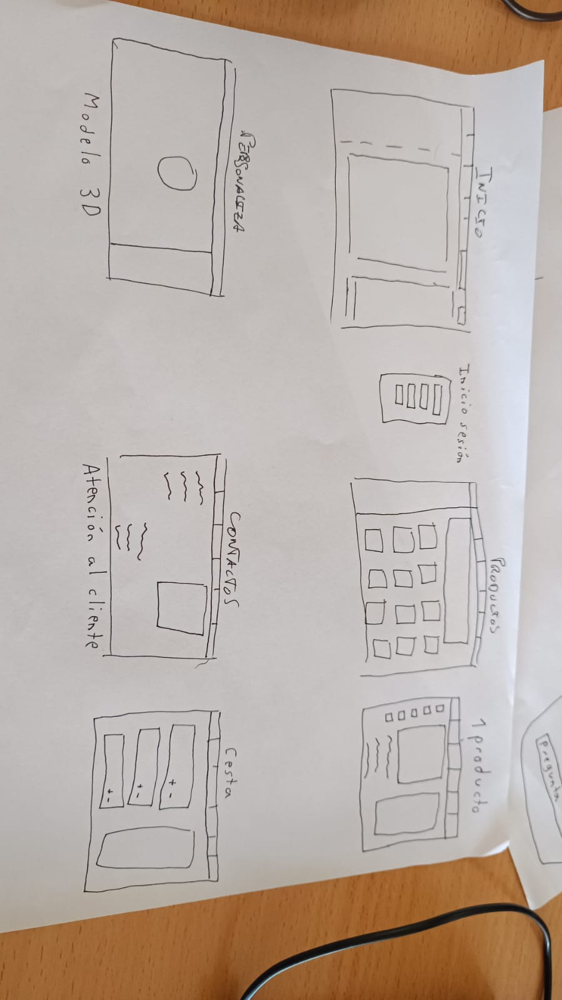

---

## Mapa de navegación

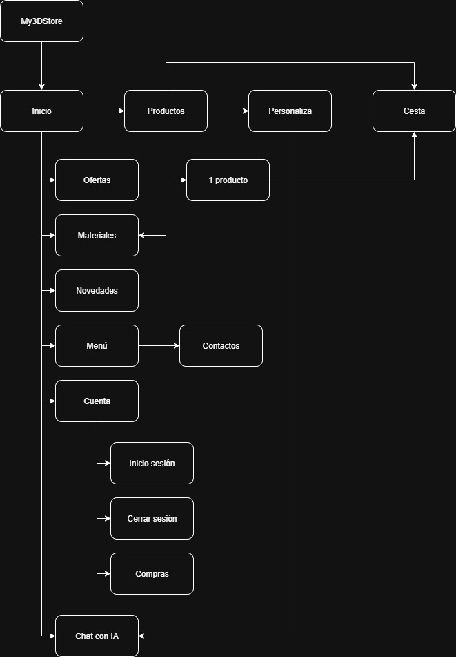

# 🧩 My3DStore — Wireframe del Proyecto

Este proyecto consiste en el diseño y estructura funcional de **My3DStore**, una tienda online centrada en productos impresos en 3D.  
El objetivo principal es ofrecer una experiencia de usuario intuitiva, moderna y personalizada mediante la integración de IA para la creación de productos.

---

## 🏠 Página de inicio

Esta es la página de inicio, en el encabezado tenemos el identificador de la página web (**My3DStore**) y la zona de navegación, que está compuesta por:

- Barra de búsqueda  
- Perfil  
- Menú desplegable  
- Inicio  
- Productos  
- Personalización  
- Cesta  

En la zona de contenido se pueden observar diferentes carruseles, cada uno de ellos representa el tipo de material del que está compuesto el producto en venta que haya en el carrusel.  

En cada una de las páginas de esta web se podrá visualizar un icono de **Chat-Bot** que tendrá incorporada una inteligencia artificial. Este icono se mostrará en el lado derecho de la pantalla.  

Además, hemos añadido un **pie de página** que servirá como atención al cliente, donde se podrá rellenar un formulario de contacto.

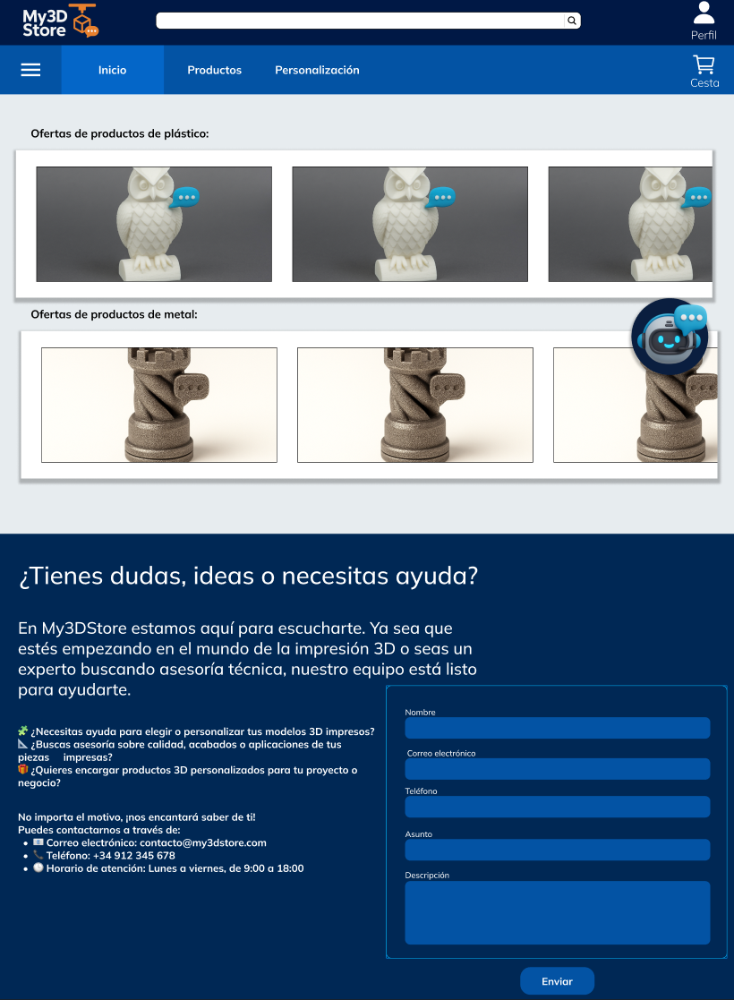

---

## 🛍️ Página de productos

Esta página contiene el mismo encabezado que la anterior, el **Chat-Bot** y el **pie de página**.  

Sin embargo, aquí se muestran todos los productos, donde se podrá **filtrar por precio** y por **material de impresión**.  

Cada producto tiene 2 opciones:

- **Añadir a la cesta:** este botón apunta directamente a la cesta.  
- **Personaliza:** este botón apunta directamente a la página de personalización.

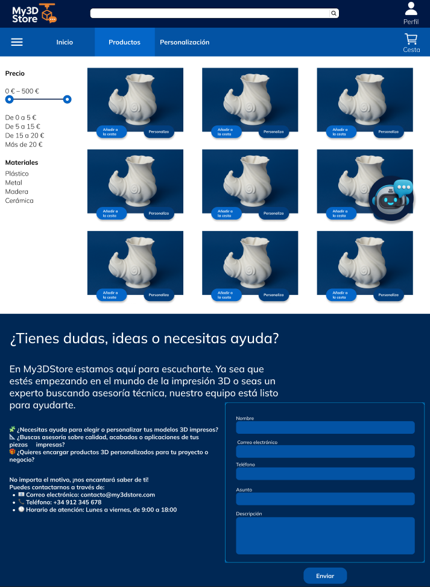

---

## 📦 Página de producto

En esta página se visualiza el producto seleccionado, donde se indica el **título del producto**, el **precio**, una **breve descripción**, sus **dimensiones y peso**, y el **material** del que está hecho el producto.  

Además, se puede pulsar el icono del **Chat-Bot** por si se quiere personalizar este producto en concreto con IA.  

Debajo del producto hay dos botones:

- **Compra ya:** te lleva directamente al carrito de la compra para procesar el pago.  
- **Añadir a la cesta:** apunta directamente a la cesta.

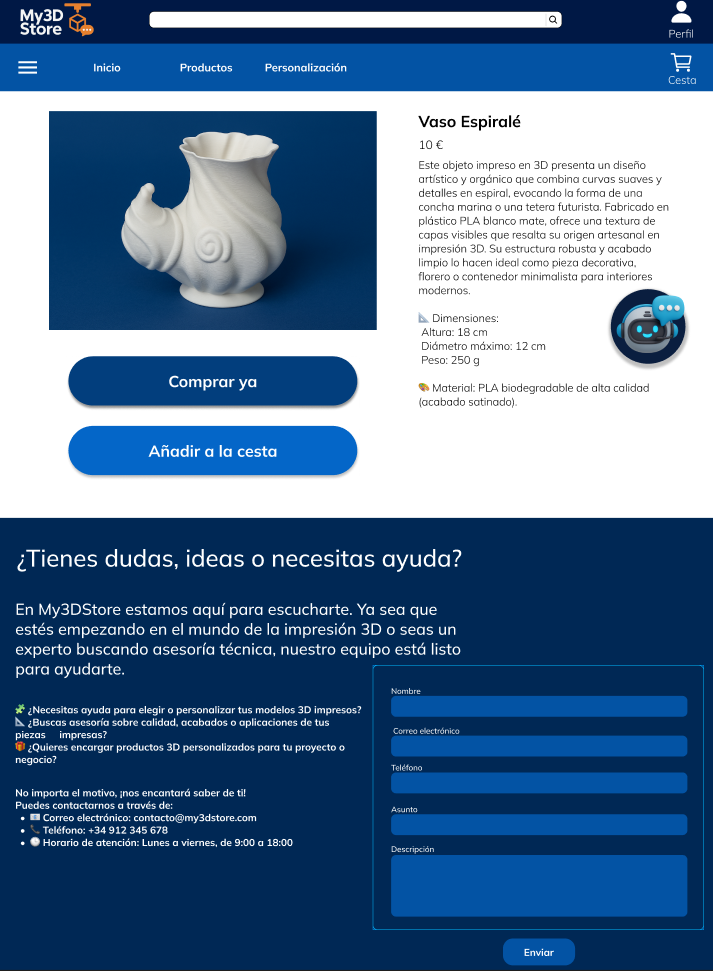

---

## 📋 Menú desplegable

Este es el menú que aparece al pulsar en la pestaña de las tres rallitas de la zona de navegación.  
Aquí encontramos diferentes apartados:

- **Materiales:** una lista de los materiales disponibles.  
- **Ofertas**  
- **Novedades**  
- **Diseño con IA:** apunta directamente a la página de personalización.  
- **Cuenta:** te redirige al menú de iniciar sesión o registrarte.

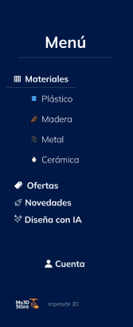

---

## 👤 Cuenta

Este es el menú de cuenta.  

En primer lugar, al pulsar el icono de cuenta nos redirige al menú de **Iniciar sesión**, donde se piden 2 campos:

- **Usuario**  
- **Contraseña**

Una vez introducidos los campos, pulsaríamos **“Iniciar sesión”**, lo que nos redirigiría a la página de inicio.  

Si no recordamos la contraseña, habrá un botón de **“He olvidado mi contraseña”** para poder recuperarla.

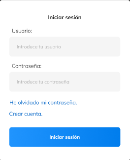

### 🧾 Crear cuenta
En el caso de que no tengamos cuenta, hay un botón de **“Crear cuenta”** que, al pulsarlo, nos redirige al menú de **“Crear cuenta”**.  

En él, hay 3 campos:

- **Usuario:** para introducir el nombre de usuario.  
- **Contraseña**  
- **Repetir contraseña:** para validar la contraseña.  

Una vez rellenados los campos, solo habrá que pulsar el botón de **“Regístrate”** y ya tendrías la cuenta creada.

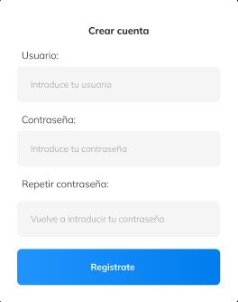

---

## 🎨 Página de personalización

Esta es la página más importante de todas.  

En esta página se podrá **crear el producto que se quiera**, pudiendo así indicar a la **IA** lo que se quiere crear, o también eligiendo un producto de los que ya estén en venta y personalizarlo como se desee.  

Esta página contiene, además del **encabezado** y el **pie de página**, un **chat** que tendrá incorporada **Inteligencia Artificial**, para indicar el producto que deseamos crear.  

A la izquierda hay un **menú de personalización**, donde se puede:

- Modificar el **ancho**, **alto** y **profundidad** del producto.  
- Escoger un **color**.  
- Elegir el **tipo de material** del que se quiere que sea el producto.  
- Subir una **imagen o logo**, por si el cliente desea añadir elementos gráficos al producto.  

En el centro de la página se mostrará la **imagen en 3D** del producto conforme se vaya personalizando.  

En la parte inferior hay un botón de **“Añadir al carrito”**.

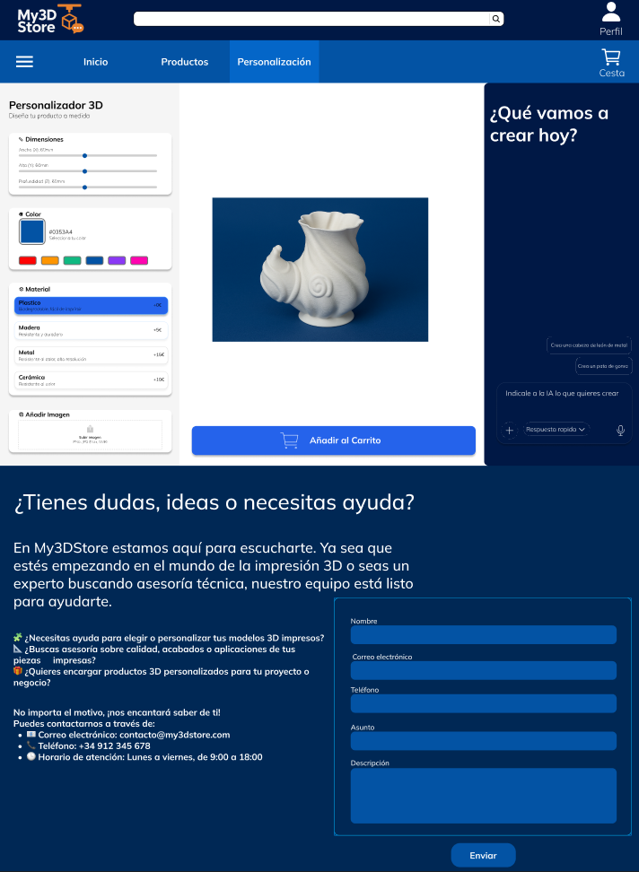

---

## 🧺 Cesta

En esta página se visualizan los productos que se han añadido a la cesta.  

Para cada producto hay una opción de **sumar o restar unidades**, además de mostrar el **título**, **precio** y **descripción**.  

A la derecha hay un recuadro que muestra el **precio total de la cesta** y un botón de **“Tramitar pedido”**, que al pulsarlo finalizaría la compra.

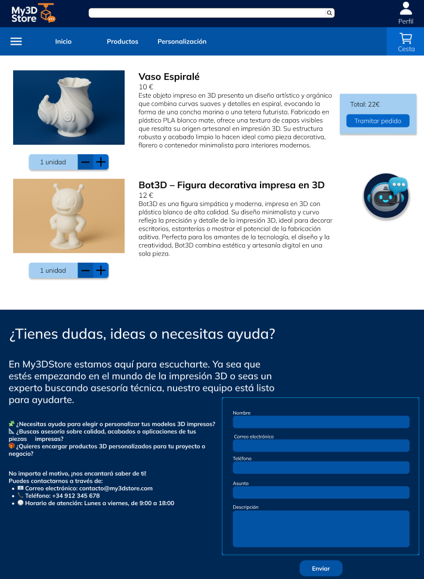

---

## 🤖 Chat-Bot

Este es el chat que se muestra al pulsar en el icono de **Chat-Bot**.  

Tiene un **recuadro de chat** para poder escribir y un **botón para enviar**.  

La idea de este chat es recibir una serie de **preguntas** para describirle a la **IA** el tipo de producto que se desea.  

Una vez finalizadas las preguntas, te redirige a la **página de personalización**.

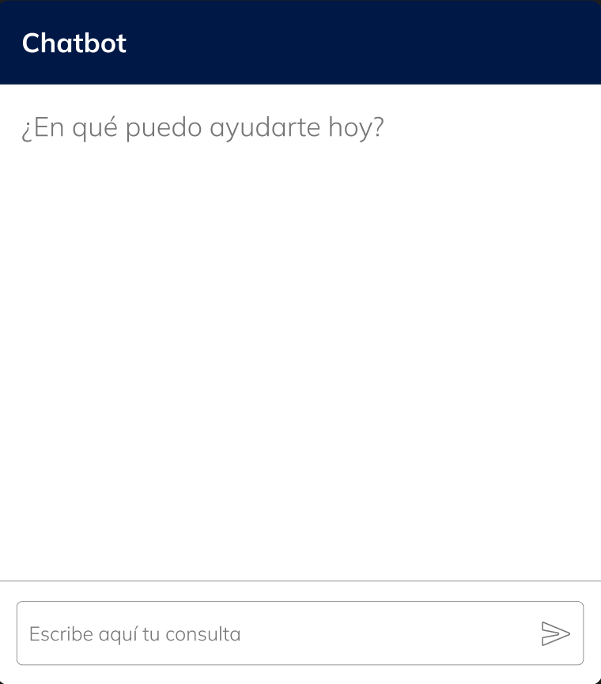

---

## 🧠 Autores

Proyecto realizado por **Izan** y **Fernando**.  
📅 *Wireframe documentado en “WireFrime Izan y Fernando (My3DStore)”*.

---
## Enlace
https://www.figma.com/proto/9Ur97wJtygMyBZPAMFmOfD/My3DStore?node-id=0-1&t=RQernRWrN0SS5XiP-1

# MEMORIA DEL PROYECTO

# My3DStore

------------------------------------------------------------------------

# 1. Introducción

My3DStore es una aplicación web orientada a usuarios particulares que
permite buscar, visualizar y adquirir productos diseñados para impresión
3D. El sistema combina funcionalidades propias de un comercio
electrónico moderno con herramientas específicas del ámbito de la
fabricación aditiva.

El proyecto integra:

-   Gestión completa de usuarios.
-   Catálogo dinámico de productos.
-   Visualización y gestión de modelos STL/GLB.
-   Carrito y sistema de pedidos.
-   Panel de administración.
-   Automatización mediante scraping.
-   Microservicio independiente de Inteligencia Artificial.
-   Arquitectura basada en contenedores Docker.
-   Despliegue en entorno cloud (Railway).

------------------------------------------------------------------------

# 2. Contexto y Justificación

El mercado de la impresión 3D ha crecido considerablemente en los
últimos años. Sin embargo, muchas plataformas permiten descargar modelos
pero no ofrecen una experiencia completa de personalización y compra
centralizada.

My3DStore surge como una solución que combina:

-   Experiencia de e-commerce tradicional.
-   Gestión directa de archivos imprimibles.
-   Automatización de catálogo.
-   Integración de IA para enriquecer contenido.

------------------------------------------------------------------------

# 3. Objetivos del Proyecto

## 3.1 Objetivo General

Desarrollar una plataforma web funcional y escalable que permita vender
productos imprimibles en 3D, incorporando inteligencia artificial y
arquitectura modular.

## 3.2 Objetivos Específicos

-   Implementar autenticación segura.
-   Diseñar catálogo dinámico.
-   Crear carrito y checkout funcional.
-   Desarrollar panel de administración.
-   Integrar microservicio de IA desacoplado.
-   Automatizar importación de productos.
-   Desplegar el sistema en entorno cloud.

------------------------------------------------------------------------

# 4. Análisis de Requisitos

## 4.1 Requisitos Funcionales

-   Registro, login y logout.
-   Gestión de cuenta.
-   Catálogo de productos.
-   Visualización y descarga de STL.
-   Carrito de compra.
-   Checkout.
-   Gestión de pedidos.
-   Panel administrativo.
-   Integración con microservicio IA.
-   Sistema de scraping automatizado.

## 4.2 Requisitos No Funcionales

-   Interfaz minimalista (azul/blanco).
-   Seguridad en contraseñas.
-   Arquitectura desacoplada.
-   Escalabilidad horizontal.
-   Preparación para HTTPS.
-   Disponibilidad 24/7.

------------------------------------------------------------------------

# 5. Arquitectura del Sistema

La arquitectura se basa en microservicios y contenedores Docker.

## Servicios principales

1.  Base de datos MySQL 8.
2.  Backend PHP (MVC).
3.  Servidor Nginx (Frontend).
4.  Microservicio IA (Python + FastAPI).
5.  Servicio auxiliar Python.

## Flujo de comunicación

Frontend → Backend → Base de Datos\
Backend → Microservicio IA

Todos los servicios se comunican mediante red interna Docker.

------------------------------------------------------------------------

# 6. Backend (PHP - MVC)

El backend está estructurado siguiendo el patrón MVC:

-   Models: gestión de datos.
-   Controllers: lógica de negocio.
-   Views: interfaz.

El sistema utiliza enrutamiento por parámetro `?action=` para gestionar
cada funcionalidad.

------------------------------------------------------------------------

# 7. Base de Datos

La base de datos MySQL almacena:

-   Usuarios.
-   Productos.
-   Categorías.
-   Pedidos.
-   Detalles de pedido.
-   Carrito.

Se inicializa mediante `schema.sql` automáticamente al levantar el
contenedor.

------------------------------------------------------------------------

# 8. Microservicio de Inteligencia Artificial

Desarrollado en Python con FastAPI.

Funciones:

-   Mejora automática de descripciones.
-   Procesamiento de datos IA.
-   Gestión de tareas.

Comunicación interna mediante:

AI_3D_SERVICE_URL=http://ai3d:8000

El microservicio está completamente desacoplado del backend principal.

------------------------------------------------------------------------

# 9. Sistema de Importación Automatizado

Se desarrolló un script que:

1.  Consulta modelos mediante GraphQL.
2.  Descarga imágenes.
3.  Descarga archivos STL.
4.  Mejora descripciones con IA.
5.  Inserta productos en la base de datos.

Incluye:

-   Logs.
-   Control de errores.
-   Sistema de fallback.
-   Control de duplicados.

------------------------------------------------------------------------

# 10. Seguridad

-   Cifrado de contraseñas.
-   Validación de sesión.
-   Protección de rutas administrativas.
-   Separación de red interna.
-   Preparación para HTTPS.

------------------------------------------------------------------------

# 11. Docker y Contenedores

Se utiliza Docker Compose para levantar:

-   db
-   backend
-   frontend
-   ai3d
-   python

Ventajas:

-   Entorno reproducible.
-   Modularidad.
-   Aislamiento.
-   Escalabilidad.

------------------------------------------------------------------------

# 12. Despliegue en Railway

El proyecto ha sido desplegado en Railway utilizando arquitectura basada
en contenedores independientes.

Se desplegaron:

-   Un contenedor para la base de datos MySQL.
-   Un contenedor independiente para el microservicio de IA.
-   Un contenedor para la aplicación web (backend + frontend).

Esto permite:

-   Escalar cada servicio de forma independiente.
-   Separar responsabilidades.
-   Mejorar disponibilidad.
-   Facilitar mantenimiento.

Railway gestiona:

-   Variables de entorno.
-   Redes internas.
-   Puertos dinámicos.
-   Persistencia de base de datos.

------------------------------------------------------------------------

# 13. Problemas Encontrados

-   Conflictos de puertos locales.
-   Problemas en descarga de STL.
-   Ajustes en comunicación entre contenedores.
-   Configuración de variables de entorno en Railway.
-   Manejo de persistencia de datos en entornos cloud.

Cada problema fue resuelto mediante ajustes técnicos y pruebas
iterativas.

------------------------------------------------------------------------

# 14. Mejoras Futuras

-   Pasarela de pago real.
-   Sistema de recomendaciones.
-   Personalización 3D avanzada.
-   Implementación de caché.
-   Balanceador de carga.
-   Dominio propio y certificado SSL.

------------------------------------------------------------------------

# 15. Diario de Desarrollo con IA

Durante el desarrollo se utilizó inteligencia artificial como
herramienta de apoyo técnico.

La IA ayudó en:

-   Configuración de Docker.
-   Implementación de FastAPI.
-   Resolución de errores.
-   Optimización de scraping.
-   Mejora automática de descripciones.

Sin embargo, fue necesario revisar y adaptar el código generado,
especialmente en:

-   Configuración de red entre contenedores.
-   Variables de entorno en Railway.
-   Manejo de errores en descargas externas.

Las decisiones finales de arquitectura fueron tomadas manualmente tras
análisis crítico.

------------------------------------------------------------------------

# 16. Conclusión

My3DStore es un proyecto completo que integra:

-   Desarrollo backend estructurado.
-   Microservicios.
-   Base de datos relacional.
-   Contenedores Docker.
-   Despliegue en Railway.
-   Inteligencia artificial.

La arquitectura modular y desacoplada permite escalar el sistema y
evolucionarlo hacia una solución comercial real.
